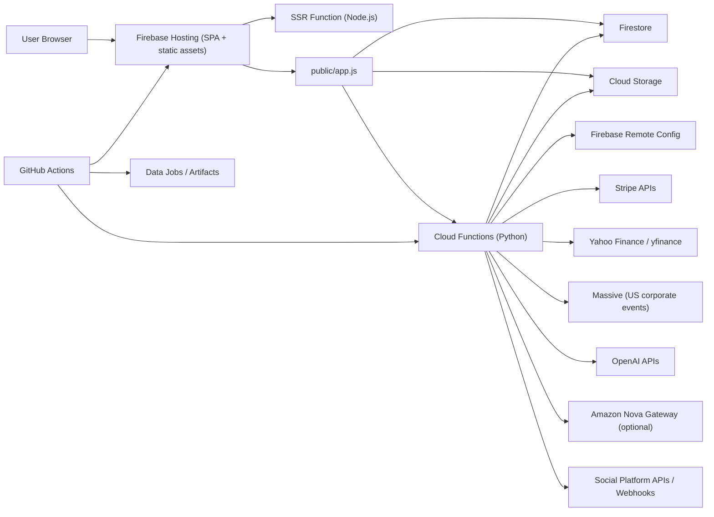
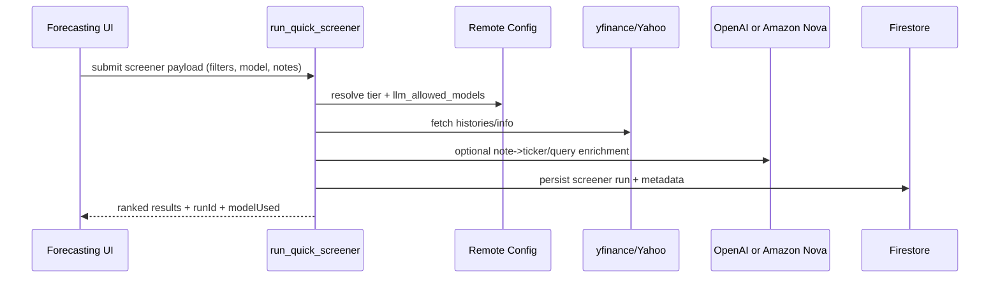

# Quantura Monorepo

<p align="center">
  <strong>Execution-grade market intelligence platform + data automation toolkit</strong><br/>
  Forecasting, screening, portfolio workflows, social intelligence, and MLOps pipelines in one repository.
</p>

<p align="center">
  
  
  
</p>

---

## Table of Contents

- [1. Project Overview](#1-project-overview)
- [2. Problem Statement](#2-problem-statement)
- [3. Core Use Cases](#3-core-use-cases)
- [4. System Architecture](#4-system-architecture)
- [5. Repository Structure](#5-repository-structure)
- [6. Frontend Module Map](#6-frontend-module-map)
- [7. Backend Function Map](#7-backend-function-map)
- [8. Data Model (Firestore)](#8-data-model-firestore)
- [9. Configuration](#9-configuration)
- [10. Local Development](#10-local-development)
- [11. Deployments](#11-deployments)
- [12. Testing and Validation](#12-testing-and-validation)
- [13. Security and Public-Ready Checklist](#13-security-and-public-ready-checklist)
- [14. Roadmap](#14-roadmap)

---

## 1. Project Overview

Quantura is a full-stack market intelligence system with:

- A Firebase-hosted web platform (`quantura_site`) for forecasting, screening, backtesting, alerts, and collaboration
- Python Cloud Functions for market analytics, AI-assisted workflows, billing, social automation, and data APIs
- SSR layer for SEO-friendly pages and Remote Config hydration
- Supporting scripts for stock data ingestion, S3 workflows, weekday-aware prediction utilities, and scheduled automation
- iOS/Android app folders for mobile clients (`quantura_ios`, `quantura_android`)

This monorepo is designed to support both:

1. Productized SaaS workflows (dashboard, subscriptions, sharing, automation)
2. Operator workflows (data exports, quant research loops, scheduled jobs)

---

## 2. Problem Statement

Most retail and semi-professional investing workflows are fragmented:

- Charting in one tab
- News and social sentiment in others
- Forecast assumptions tracked manually
- Backtest artifacts disconnected from live workflows

Quantura consolidates these into one execution surface, so users can:

- Move from thesis to forecast to backtest faster
- Track portfolio/watchlist signals in context
- Persist and share outputs across teams/workspaces
- Control model access, billing, and feature rollout centrally

---

## 3. Core Use Cases

### A. Forecasting Desk
- Input ticker + interval + horizon
- Generate quantile forecasts
- Save runs and regenerate report assets (PDF/PPT style outputs)

### B. AI Portfolio Screener
- Apply descriptive/fundamental/technical filters
- Run ranked candidate generation
- Publish or keep private AI agent portfolios

### C. Backtesting + Technical Guidance
- Run rule-based strategy backtests
- Export backtest source templates (Python/TradingView/MT5/JSON)
- Generate technical setup suggestions from recent indicators

### D. Social and News Intelligence
- Pull market headlines by country
- Integrate social pulse feeds (X/Reddit/Facebook/Instagram)
- Generate and queue social campaign drafts

### E. Collaboration + Monetization
- Workspace collaborators/invites
- Stripe checkout, billing portal, creator support/subscriptions
- Share links for forecasts/screeners/uploads

---

## 4. System Architecture



### Runtime Sequence (Screener Path)



---

## 5. Repository Structure

```text
stockssagemakerdata/
├── quantura_site/
│   ├── pages/                 # HTML pages used by Hosting + SSR template sync
│   ├── public/                # app.js, styles.css, assets, blog output
│   ├── functions/             # Python Cloud Functions backend
│   ├── functions_ssr/         # Node SSR function and template hydration
│   ├── firestore.rules
│   ├── storage.rules
│   └── firebase.json
├── quantura_android/          # Android client workspace
├── quantura_ios/              # iOS client workspace
├── scripts/                   # automation/helpers
├── fetch_data.py              # local stock fetch utility
├── fetch_data_s3.py           # fetch + S3 upload utility
├── predictions.py             # prediction CSV helper
├── combined_stock_screener.py # standalone screener CSV + Slack tool
├── Makefile
└── .github/workflows/         # CI/CD + scheduled jobs
```

### Combined Stock Screener + Slack Delivery

Generate a formatted CSV with headlines and optional Slack delivery:

```bash
python combined_stock_screener.py
```

Optional environment variables:
- `SLACK_WEBHOOK_URL` for posting a summary message.
- `SLACK_BOT_TOKEN` + `SLACK_CHANNEL` for uploading the CSV file to Slack.
- `SCREENING_OUTPUT_FILE` to override the CSV output filename.

### Quantura Marketing Site

Static site assets live in `quantura_site/`. Open `quantura_site/index.html` in a browser
and replace the Stripe placeholder buttons with live checkout URLs before deploying.

## Files

- [fetch_data.py](fetch_data.py) — CLI to download `Close` prices locally (CSV output).
- [fetch_data_s3.py](fetch_data_s3.py) — CLI to download `Close` prices and upload to AWS S3.
- [check_weekday.py](check_weekday.py) — Utility to check if a date is a weekday.
- [predictions.py](predictions.py) — Generate stock price predictions and upload to S3.
- [combined_stock_screener.py](combined_stock_screener.py) — Combined screener that outputs formatted CSV with headlines and can send results to Slack.
- [quantura_site/](quantura_site/) — Static marketing site for Quantura with Stripe-ready CTA placeholders.
- [Makefile](Makefile) — Convenient targets for common tasks.
- [requirements.txt](requirements.txt) — Python dependencies.
- [setup_aws.sh](setup_aws.sh) — Script to configure AWS CLI from environment variables.
- [.env.example](.env.example) — Template for AWS configuration.
- [.devcontainer/devcontainer.json](.devcontainer/devcontainer.json) and [.devcontainer/Dockerfile](.devcontainer/Dockerfile) — Codespace/devcontainer setup for development.
- [.github/workflows/mlops-data.yml](.github/workflows/mlops-data.yml) — Scheduled/manual workflow to fetch data and store artifacts.
- [.github/workflows/weekly-stock-screening.yml](.github/workflows/weekly-stock-screening.yml) — Weekly combined screening job with optional Slack delivery.
- [.github/workflows/linear-sync.yml](.github/workflows/linear-sync.yml) — GitHub → Linear issue sync workflow.

Use `.env.example` as baseline. Critical categories:

- AI providers:
  - `OPENAI_API_KEY`
  - `AMAZON_NOVA_API_KEY` (optional)
  - `AMAZON_NOVA_API_ENDPOINT` (optional)
  - `AMAZON_NOVA_DEFAULT_MODEL` (optional)
  - `LLM_ALLOWED_MODELS` (fallback allowlist if Remote Config value is absent)
- Billing:
  - Stripe keys and webhook secret
- Messaging:
  - `FCM_WEB_VAPID_KEY`
- Data providers:
  - Massive, Alpaca, yfinance dependencies
- Social APIs/webhooks:
  - X/LinkedIn/Facebook/Instagram/etc

---

## 10. Local Development

### Prerequisites
- Node 18+
- Python 3.10+
- Firebase CLI

### Setup

```bash
cd /Users/tamzidullah/Desktop/stockssagemakerdata
python3 -m venv .venv
source .venv/bin/activate
pip install -r requirements.txt

cd /Users/tamzidullah/Desktop/stockssagemakerdata/quantura_site
npm ci
```

### Quick validation

```bash
node --check /Users/tamzidullah/Desktop/stockssagemakerdata/quantura_site/public/app.js
node --check /Users/tamzidullah/Desktop/stockssagemakerdata/quantura_site/functions_ssr/index.js
python3 -m py_compile /Users/tamzidullah/Desktop/stockssagemakerdata/quantura_site/functions/main.py
```

---

## 11. Deployments

Deploy from `quantura_site`:

```bash
cd /Users/tamzidullah/Desktop/stockssagemakerdata/quantura_site
firebase deploy
```

Scoped deploys:

```bash
firebase deploy --only hosting
firebase deploy --only functions
firebase deploy --only functions:ssr
firebase deploy --only firestore:rules,firestore:indexes,storage
```

---

## 12. Testing and Validation

- Static checks:
  - JS syntax: `node --check`
  - Python compile checks: `py_compile`
- Targeted tests:
  - `quantura_site/tests/test_public_assets.py`
- Runtime validation:
  - Forecasting run
  - Screener run with tier/model policy
  - Backtest run + export
  - Stripe checkout + billing portal
  - Notification token registration + test push

---

## 13. Security and Public-Ready Checklist

Before making the repo public:

1. Remove any committed secrets and rotate exposed keys.
2. Keep API keys in secret managers / environment variables only.
3. Verify `.env`, service accounts, and token files are gitignored.
4. Keep these files local-only (never committed):
   - `quantura_site/functions/serviceAccountKey.json`
   - `quantura_ios/quantura_ios/GoogleService-Info.plist`
   - `quantura_android/app/google-services.json`
5. Bootstrap local placeholders with:
   - `./scripts/setup_local_firebase_credentials.sh`
6. If key exposure occurred, revoke/rotate immediately and purge Git history for leaked files.
7. Re-check Firestore and Storage rules for least privilege.
8. Confirm admin-only features are enforced server-side (not UI-only).
9. Validate Stripe webhook signature handling and callback allowlists.
10. Verify social integrations fail safely when credentials are missing.
11. Keep `llm_allowed_models` constrained to approved models for cost/control.

### Immediate GCP/Firebase leak response

1. Disable and recreate exposed API keys in Google Cloud Console.
2. Restrict replacement API keys:
   - iOS key: restrict by bundle ID + only required APIs.
   - Android key: restrict by package name + SHA-1 + only required APIs.
   - Web key: restrict by HTTP referrers + only required APIs.
3. Disable compromised service-account keys and create new credentials only if required.
4. Prefer Workload Identity / Application Default Credentials over downloadable key files.
5. Purge leaked files from all Git history and force-push rewritten history.
6. Invalidate any copied secrets from CI/CD systems and re-seed them as repository/environment secrets.

---

## 14. Roadmap

- Expand model orchestration policy with per-feature model routing
- Add deeper explainability traces on screener ranking decisions
- Add benchmark backtest suites and reproducibility snapshots
- Extend international market coverage for events and social intelligence
- Harden observability dashboards for function memory/latency/error budgets

---

### Maintainer Note

If you are onboarding as a new contributor, start with:

1. `quantura_site/public/app.js` (client orchestration)
2. `quantura_site/functions/main.py` (business logic and integrations)
3. `quantura_site/functions_ssr/index.js` (SSR and Remote Config hydration)
4. `quantura_site/firebase.json` + rules files (deployment and access control)
