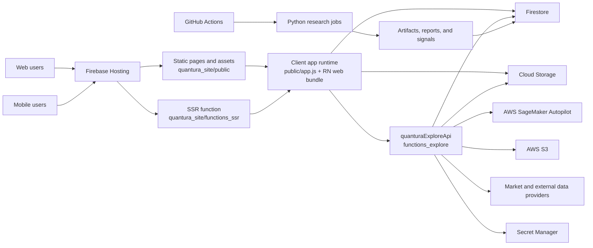
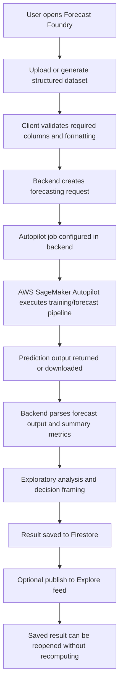
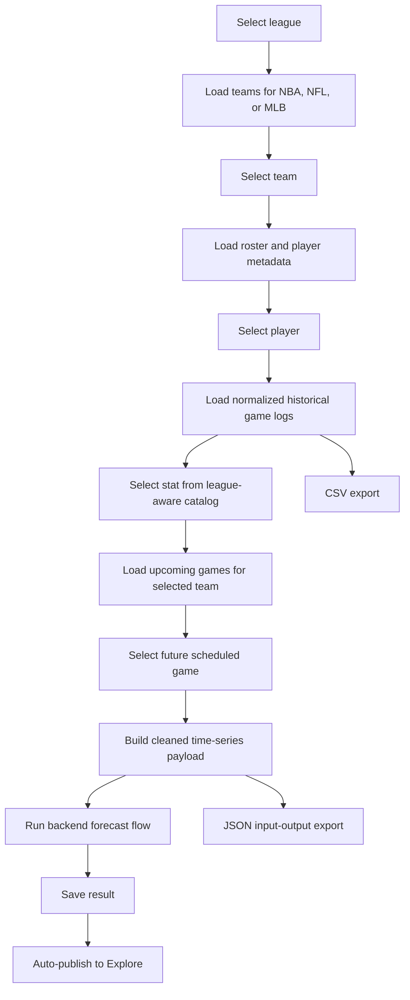
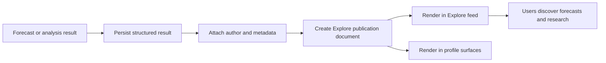
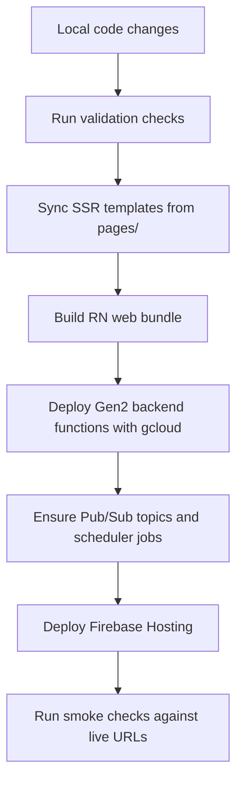

# Quantura

Quantura is a production market-intelligence, forecasting, research, and publishing platform. This monorepo powers the live web experience at [quantura.studio](https://quantura.studio), the Firebase-hosted environment at [quantura-e2e3d.web.app](https://quantura-e2e3d.web.app), supporting mobile workspaces, server-side APIs, scheduled research automation, and deployment tooling.

The repository is intentionally broad. It contains the customer-facing site, the authenticated dashboard, Explore publishing workflows, Forecast Foundry, sports forecasting, e-commerce and billing surfaces, newsletter infrastructure, server-side rendering, mobile shells, and daily research automation.

## Table of Contents

- [Platform Overview](#platform-overview)
- [Production Surfaces](#production-surfaces)
- [System Architecture](#system-architecture)
- [Repository Map](#repository-map)
- [Core Workflows](#core-workflows)
- [Runtime and Data Model](#runtime-and-data-model)
- [Local Development](#local-development)
- [Testing and Validation](#testing-and-validation)
- [Deployment and Operations](#deployment-and-operations)
- [Environment Variables and Secrets](#environment-variables-and-secrets)
- [Contributor Workflow](#contributor-workflow)
- [Automation and Scheduled Jobs](#automation-and-scheduled-jobs)
- [Documentation and Governance](#documentation-and-governance)
- [Security](#security)
- [License](#license)

## Platform Overview

Quantura combines research tooling, AI-assisted forecasting, publishing, and operational workflows in one stack.

Core product themes:

- market research, dashboards, and watchlist-driven workflows
- Forecast Foundry time-series modeling and prediction review
- historical data workflows and exports
- Explore publishing, profile surfaces, and public discovery
- sports forecasting workflows for NBA, NFL, and MLB
- mobile and web product delivery from a shared product codebase
- internal operations for admin, notifications, subscriptions, and fulfillment

This repository is the operational source of truth for:

- web pages and dashboard experiences
- client-side JavaScript and styling
- Node.js Gen2 Cloud Functions APIs
- server-side rendering templates and runtime
- Python-based newsletter and research jobs
- build, deploy, and smoke-check procedures

## Production Surfaces

| Surface | Purpose | Primary location |
| --- | --- | --- |
| Public marketing site | Landing pages, pricing, blog, legal, product education | `quantura_site/pages/`, `quantura_site/public/` |
| Authenticated dashboard | Forecasting, saved runs, watchlists, alerts, account workflows | `quantura_site/pages/dashboard*.html`, `quantura_site/public/app.js` |
| Forecast Foundry | Time-series forecasting flow, CSV upload/analysis, Autopilot integration | `quantura_site/public/app.js`, `quantura_site/functions_explore/src/` |
| Sports forecasting | League -> team -> player -> stat -> future game forecast workflow | `quantura_site/public/app.js`, `quantura_site/functions_explore/src/` |
| Explore | Published forecast outputs, community-style discovery, profile surfaces | `quantura_site/public/explore*`, `quantura_site/functions_explore/src/` |
| SSR app shell | Server-rendered delivery for page templates and route handling | `quantura_site/functions_ssr/` |
| Newsletter pipeline | Email send/unsubscribe handlers and scheduled weekly jobs | `quantura_site/functions_newsletter/` |
| Mobile workspaces | Android and iOS client projects | `quantura_android/`, `quantura_ios/` |
| Research automation | Scheduled stock-screening and signal-generation jobs | repo root Python scripts, `.github/workflows/` |

## System Architecture

The platform uses Firebase Hosting for delivery, Cloud Functions Gen2 for APIs and SSR, Firestore and Storage for persistence, AWS services for forecasting execution, and Python/GitHub Actions for scheduled research automation.


```mermaid
flowchart LR
    A["Web users"] --> B["Firebase Hosting"]
    M["Mobile users"] --> B
    B --> C["Static pages and assets<br/>quantura_site/public"]
    B --> D["SSR function<br/>quantura_site/functions_ssr"]
    C --> E["Client app runtime<br/>public/app.js + RN web bundle"]
    D --> E
    E --> F["quanturaExploreApi<br/>functions_explore"]
    E --> G["Firestore"]
    E --> H["Cloud Storage"]
    F --> G
    F --> H
    F --> I["AWS SageMaker Autopilot"]
    F --> J["AWS S3"]
    F --> K["Market and external data providers"]
    F --> L["Secret Manager"]
    N["GitHub Actions"] --> O["Python research jobs"]
    O --> P["Artifacts, reports, and signals"]
    P --> G
```

### Architectural Notes

- `quantura_site/pages/` is the editable source for HTML page content.
- `quantura_site/functions_ssr/templates/` is generated from `pages/` and should not be edited directly.
- `quantura_site/public/` contains browser-delivered assets, application logic, CSS, icons, and build outputs.
- `quantura_site/functions_explore/` is the main API layer for Forecast Foundry, Explore, sports forecasting, saved outputs, publish flows, and related app logic.
- `quantura_site/functions_newsletter/` handles newsletter send/unsubscribe behavior and scheduled publishing hooks.
- AWS-backed forecasting is orchestrated from the backend, not from the browser.

## Repository Map

```text
stockssagemakerdata/
├── quantura_site/
│   ├── pages/                     # Source HTML for public pages and dashboard screens
│   ├── public/                    # Client JS, CSS, assets, service worker, static output
│   ├── rnweb/                     # React Native Web source used to build injected bundle
│   ├── functions_explore/         # TypeScript Gen2 API for forecasting, Explore, sports, billing
│   ├── functions_ssr/             # Gen2 SSR runtime + template sync script
│   ├── functions_newsletter/      # Python newsletter handlers and scheduled email jobs
│   ├── functions/                 # Additional Python/SQL utilities and supporting services
│   ├── services/                  # Shared supporting service modules, including market data
│   ├── scripts/                   # App-specific scripts and utilities
│   ├── docs/                      # Product notes and screenshots
│   ├── tests/                     # Test suite and validation helpers
│   ├── firebase.json              # Hosting/function config and SSR predeploy hooks
│   ├── firestore.rules            # Firestore security rules
│   ├── firestore.indexes.json     # Firestore composite indexes
│   └── storage.rules              # Cloud Storage security rules
├── quantura_android/              # Android application workspace
├── quantura_ios/                  # iOS application workspace
├── .github/workflows/             # CI, smoke checks, sitemap, stock screener, readiness reporting
├── deploy.sh                      # Canonical production deploy entrypoint
├── daily_prophet_signal_tracker.py
├── combined_stock_screener.py
├── requirements.txt
├── CONTRIBUTING.md
├── CODE_OF_CONDUCT.md
├── SECURITY.md
└── LICENSE
```

### Key Application Boundaries

#### `quantura_site/public/`

This is the main browser runtime. It contains:

- shared app behavior in `public/app.js`
- global styling in `public/styles.css`
- Explore/profile-specific scripts and styles
- static assets, icons, and public page payloads
- the generated React Native Web injection bundle used by the site

#### `quantura_site/functions_explore/`

This is the primary application backend. It is responsible for:

- Forecast Foundry request creation and result analysis
- sports forecasting providers, normalization, and forecast persistence
- saved outputs, publication flows, and Explore feed integration
- external provider access and backend-only secret usage
- shop and operational HTTP endpoints
- Firestore and Pub/Sub-triggered follow-up processing

#### `quantura_site/functions_ssr/`

This service renders SSR-delivered pages and depends on synced HTML templates. Any page-level source update should be made in `quantura_site/pages/`, then synced into `functions_ssr/templates/` using the provided script.

#### Repo-root Python automation

The root Python scripts support scheduled research and stock-screening workflows. They are operational automation, not browser-side product logic.

## Core Workflows

### 1. Forecast Foundry Workflow

Forecast Foundry is the central time-series workflow for uploaded historical data and Autopilot-backed forecasting.


```mermaid
flowchart TD
    A["User opens Forecast Foundry"] --> B["Upload or generate structured dataset"]
    B --> C["Client validates required columns and formatting"]
    C --> D["Backend creates forecasting request"]
    D --> E["Autopilot job configured in backend"]
    E --> F["AWS SageMaker Autopilot executes training/forecast pipeline"]
    F --> G["Prediction output returned or downloaded"]
    G --> H["Backend parses forecast output and summary metrics"]
    H --> I["Exploratory analysis and decision framing"]
    I --> J["Result saved to Firestore"]
    J --> K["Optional publish to Explore feed"]
    K --> L["Saved result can be reopened without recomputing"]
```

Forecast Foundry currently supports:

- historical data ingestion and formatting review
- saved forecast requests and reopened result views
- prediction CSV analysis
- context-rich summaries and research guidance
- export-oriented workflows for downstream review

### 2. Sports Forecasting Workflow

The User Dashboard includes a sports forecasting workflow modeled after Forecast Foundry patterns.


```mermaid
flowchart TD
    A["Select league"] --> B["Load teams for NBA, NFL, or MLB"]
    B --> C["Select team"]
    C --> D["Load roster and player metadata"]
    D --> E["Select player"]
    E --> F["Load normalized historical game logs"]
    F --> G["Select stat from league-aware catalog"]
    G --> H["Load upcoming games for selected team"]
    H --> I["Select future scheduled game"]
    I --> J["Build cleaned time-series payload"]
    J --> K["Run backend forecast flow"]
    K --> L["Save result"]
    L --> M["Auto-publish to Explore"]
    F --> N["CSV export"]
    J --> O["JSON input-output export"]
```

Product expectations for the sports flow:

- league-aware filtering across NBA, NFL, and MLB
- normalized team, player, stat, and schedule metadata
- historical player/game preview before forecast execution
- download/export of forecast-ready data
- save and reload behavior consistent with existing dashboard patterns
- Explore publication created from successful results

### 3. Explore Publishing Workflow

Explore is not just a static feed. It is the publication layer for forecast outputs, saved runs, and user-facing forecast artifacts.


```mermaid
flowchart LR
    A["Forecast or analysis result"] --> B["Persist structured result"]
    B --> C["Attach author and metadata"]
    C --> D["Create Explore publication document"]
    D --> E["Render in Explore feed"]
    D --> F["Render in profile surfaces"]
    E --> G["Users discover forecasts and research"]
```

### 4. Deployment Workflow

Production deployment is opinionated and should follow the repo policy exactly.


```mermaid
flowchart TD
    A["Local code changes"] --> B["Run validation checks"]
    B --> C["Sync SSR templates from pages/"]
    C --> D["Build RN web bundle"]
    D --> E["Deploy Gen2 backend functions with gcloud"]
    E --> F["Ensure Pub/Sub topics and scheduler jobs"]
    F --> G["Deploy Firebase Hosting"]
    G --> H["Run smoke checks against live URLs"]
```

## Runtime and Data Model

### Frontend Delivery

- Firebase Hosting serves public assets and route entrypoints.
- Shared browser behavior lives primarily in `quantura_site/public/app.js`.
- Styling is centralized in `quantura_site/public/styles.css` with page-specific CSS where needed.
- React Native Web assets are built into the public app and injected into the site experience where appropriate.

### Backend Execution

- `quanturaExploreApi` is the main HTTP API surface for app features.
- `shopApi` supports commerce and billing-related backend tasks.
- Firestore-triggered handlers react to newly created forecast, backtest, screener, and agent documents.
- Pub/Sub-triggered handlers support recurring data refresh and Autopilot reconciliation.

### Persistence

- Firestore stores structured requests, saved results, publishable metadata, feed content, and user-linked entities.
- Cloud Storage is used for files and exported artifacts.
- AWS S3 is used for Autopilot-related forecasting assets where required by the forecasting flow.

### External Integrations

- AWS SageMaker Autopilot for forecasting workflows
- AWS S3 for model artifacts and associated data exchange
- market and research data providers for historical data workflows
- Stripe for billing surfaces
- Secret Manager for production secrets and service credentials

## Local Development

### Prerequisites

- Node.js 20+ for local site tooling
- Node.js 24 compatibility for Cloud Functions runtime work
- Python 3.11+ for repo scripts and tests
- Firebase CLI for hosting operations
- Google Cloud CLI for Cloud Functions and scheduler operations

### Install Web Dependencies

```bash
cd /Users/tamzidullah/Desktop/stockssagemakerdata/quantura_site
npm install
```

### Install Python Dependencies

```bash
cd /Users/tamzidullah/Desktop/stockssagemakerdata
python3 -m pip install -r requirements.txt
```

### Source-of-Truth Rules

- Edit page markup in `quantura_site/pages/`.
- Edit app runtime logic in `quantura_site/public/app.js` and related scripts.
- Edit global styling in `quantura_site/public/styles.css`.
- Edit application backend behavior in `quantura_site/functions_explore/src/`.
- Edit SSR logic in `quantura_site/functions_ssr/`.
- Do not hand-edit `quantura_site/functions_ssr/templates/`; those files are generated from `pages/`.

### Common Local Commands

```bash
node --check quantura_site/public/app.js
node --check quantura_site/functions_ssr/index.js
python3 daily_prophet_signal_tracker.py --help
pytest -q quantura_site/tests
```

### Sync SSR Templates After Page Changes

```bash
node quantura_site/functions_ssr/scripts/sync-templates.js
```

## Testing and Validation

The exact validation checklist depends on the surface you touched, but production-ready changes should usually include the following:

1. syntax checks for touched browser and SSR JavaScript files
2. TypeScript build checks for `quantura_site/functions_explore/` when backend behavior changes
3. targeted manual validation of the affected UI or API workflow
4. template sync verification if any source HTML page changed
5. smoke checks for relevant live endpoints after deploy

Recommended command set:

```bash
node --check quantura_site/public/app.js
node --check quantura_site/functions_ssr/index.js
cd /Users/tamzidullah/Desktop/stockssagemakerdata/quantura_site/functions_explore && npm run build
cd /Users/tamzidullah/Desktop/stockssagemakerdata/quantura_site && npm run build
pytest -q /Users/tamzidullah/Desktop/stockssagemakerdata/quantura_site/tests
```

When validating dashboard or Explore changes, check:

- logged-out behavior
- logged-in behavior
- empty states
- loading states
- failure states
- mobile layout
- saved artifact reopening behavior if persistence is involved

## Deployment and Operations

The canonical production deployment path is the repo-root script:

```bash
cd /Users/tamzidullah/Desktop/stockssagemakerdata
./deploy.sh
```

Do not use `firebase deploy --only functions` for this repository.

Deployment order:

1. resolve project configuration and runtime defaults
2. optionally build functions locally
3. sync SSR templates
4. build the React Native Web bundle
5. deploy Gen2 HTTP APIs and triggered functions with `gcloud functions deploy`
6. ensure required Pub/Sub topics exist
7. ensure Cloud Scheduler jobs exist and match repo defaults
8. deploy the SSR function
9. deploy frontend hosting with Firebase

### Functions and Jobs Managed by `deploy.sh`

- `quanturaExploreApi`
- `shopApi`
- `onForecastCreated`
- `onBacktestCreated`
- `onScreenerRunCreated`
- `onAgentRunCreated`
- `refreshFiscaldataDefaults`
- `reconcileAutopilotRuns`
- `send_newsletter_daily_http`
- `email_unsubscribe_http`
- `send_newsletter_weekly_scheduler`
- Cloud Scheduler jobs for weekly newsletter and Autopilot reconcile flows

### Live Smoke Checks

```bash
curl -sS https://quantura.studio/api/health

curl -sS -X POST https://quantura.studio/api/analytics/ad-impression \
  -H "Content-Type: application/json" \
  -d '{"platform":"android","adPlatform":"admob","adFormat":"rewarded","adUnitId":"test-unit"}'

curl -sS https://quantura.studio/api/shop/catalog

curl -sS -X POST https://quantura.studio/api/email/send-campaign \
  -H "Content-Type: application/json" \
  -H "X-Newsletter-Admin-Key: <NEWSLETTER_ADMIN_KEY>" \
  -d '{"mode":"newsletter","dryRun":true,"campaign":{"title":"Weekly workflow update"}}'
```

## Environment Variables and Secrets

`deploy.sh` resolves `PROJECT_ID` from either:

1. the `PROJECT_ID` environment variable
2. `quantura_site/.firebaserc`

Important runtime/deploy variables include:

| Variable | Purpose |
| --- | --- |
| `PROJECT_ID` | Target Google Cloud / Firebase project |
| `REGION` | Cloud Functions deployment region |
| `FIRESTORE_TRIGGER_LOCATION` | Firestore trigger location |
| `FUNCTIONS_RUNTIME` | Node runtime for Gen2 functions |
| `PYTHON_FUNCTIONS_RUNTIME` | Python runtime for newsletter functions |
| `PUBLIC_ORIGIN` | Public site origin used by deployed services |
| `NEWSLETTER_TOPIC` | Pub/Sub topic for weekly newsletter scheduling |
| `NEWSLETTER_SCHEDULER_JOB` | Scheduler job name for newsletter flow |
| `AUTOPILOT_RECONCILE_TOPIC` | Pub/Sub topic for forecasting reconcile flow |
| `AUTOPILOT_RECONCILE_JOB` | Scheduler job for reconcile processing |
| `LOCAL_FUNCTIONS_BUILD` | Whether to compile backend functions locally before deploy |

Secrets must never be committed to git. Use Secret Manager bindings through `GCLOUD_SET_SECRETS` or let `deploy.sh` auto-discover supported secret names.

Typical secret categories:

- LLM provider API keys
- market data provider keys
- Stripe and webhook secrets
- newsletter admin and AWS email credentials
- mobile/webhook integrity secrets
- forecasting-specific AWS credentials and role/bucket bindings

For complete deployment policy, see [DEPLOY.md](DEPLOY.md).

## Contributor Workflow

### Recommended Change Process

1. identify the owning surface before editing
2. update the true source of truth rather than generated output when possible
3. run targeted validation locally
4. sync SSR templates if any page source changed
5. review `git diff` for accidental generated-noise churn
6. deploy through `./deploy.sh` when production release is intended

### Practical Editing Rules

- If you change `quantura_site/pages/`, sync SSR templates before shipping.
- If you change dashboard workflows, test both the happy path and empty/failure states.
- If you change Explore or profile surfaces, confirm authoring, publication, and rendering still line up.
- If you change backend forecasting flows, verify saved results can be reopened later without recomputation when that is the intended behavior.
- If you change any secret-backed integration, verify configuration through Secret Manager instead of local hardcoding.

### Where to Start

- Repo-level overview: this file
- Web-app-specific guidance: [quantura_site/README.md](quantura_site/README.md)
- Contribution standards: [CONTRIBUTING.md](CONTRIBUTING.md)
- Responsible disclosure: [SECURITY.md](SECURITY.md)

## Automation and Scheduled Jobs

The repository includes both product-side automation and research-side automation.

### GitHub Actions

Current workflow files include:

- `codeql.yml`
- `quantura-app-ci.yml`
- `quantura-live-smoke.yml`
- `quantura-sitemap.yml`
- `stock-screener.yml`
- `workflow-readiness-report.yml`

### Research Automation

The repo-root stock screening scripts support recurring signal generation and report creation. The daily Prophet tracker is designed to:

- scan broad equity universes
- filter by market-cap requirements
- compute quantile-band based signal conditions
- write artifacts for active signals and state transitions
- run on scheduled GitHub Actions timing near market close

## Documentation and Governance

This repository includes the baseline project and community files expected for a production engineering workspace:

- [README.md](README.md)
- [DEPLOY.md](DEPLOY.md)
- [CONTRIBUTING.md](CONTRIBUTING.md)
- [CODE_OF_CONDUCT.md](CODE_OF_CONDUCT.md)
- [SECURITY.md](SECURITY.md)
- [LICENSE](LICENSE)
- issue templates in [`.github/ISSUE_TEMPLATE/`](.github/ISSUE_TEMPLATE)
- pull request template in [`.github/PULL_REQUEST_TEMPLATE.md`](.github/PULL_REQUEST_TEMPLATE.md)

## Security

Do not report vulnerabilities in public issues or public pull requests. Follow the coordinated disclosure guidance in [SECURITY.md](SECURITY.md).

Never commit:

- API keys
- service-account credentials
- production webhook secrets
- private mobile config credentials
- copied production data exports that should remain private

## License

This repository is licensed under the MIT License. See [LICENSE](LICENSE) for the full text.
