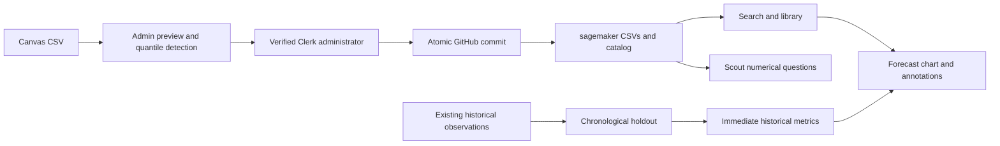
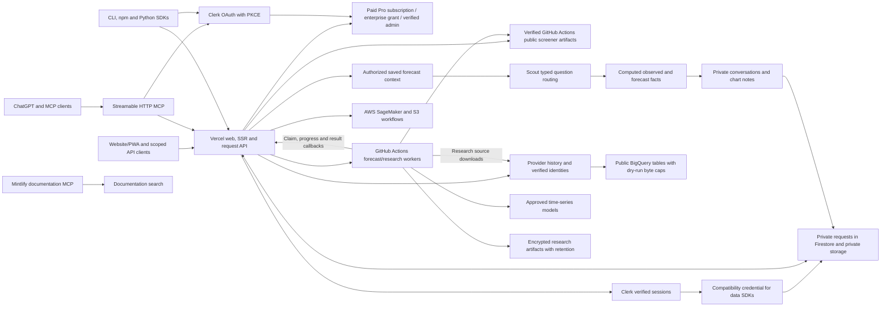
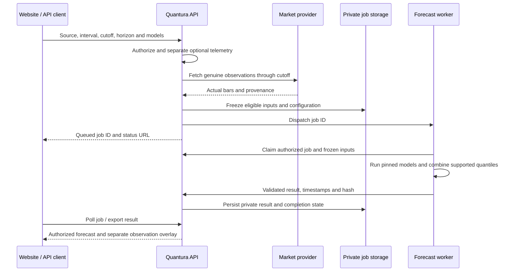

# Quantura

### Canvas library and forecast quality (October 7, 2026)

- **[SageMaker library](https://quantura.studio/sagemaker):** 133 dated Canvas forecasts and 14 historical series, searchable by ticker and filename. Preview source CSVs, view quantiles, annotate chart points, and ask Scout. Original values are preserved; an export without a year remains a file preview.
- **[Admin uploads](https://quantura.studio/sagemaker/admin):** verified administrator uploads auto-detect quantiles, set a ticker/name, and optionally supply model metrics with their evaluation basis. A server-side GitHub token commits the CSV and catalog atomically into `sagemaker/`; no forecast CSV is uploaded to Firestore or cloud storage. Private Scout conversations and notes continue using account storage.
- **Immediate quality metrics:** newly requested forecasts opt into a bounded chronological holdout using existing history only. Show MAE, RMSE, sMAPE and average weighted quantile loss when computed; hide unavailable scores. Canvas scores remain explicitly admin supplied. Research and live trading workers without the policy keep their original single forecast pass.
- **Chart scope:** actual-price overlays stop at the last prediction timestamp (including the final daily session); the chart cannot extend the requested horizon with later observations. Header search includes a CSV upload plus icon.


```mermaid
flowchart LR
    CSV[Canvas CSV] --> Preview[Admin preview and quantile detection]
    Preview --> Gate[Verified Clerk administrator]
    Gate --> Commit[Atomic GitHub commit]
    Commit --> Repo[sagemaker CSVs and catalog]
    Repo --> Search[Search and library]
    Search --> Chart[Forecast chart and annotations]
    Repo --> Scout[Scout numerical questions]
    History[Existing historical observations] --> Holdout[Chronological holdout]
    Holdout --> Scores[Immediate historical metrics]
    Scores --> Chart
```

Rebuild the sanitized archive catalog with `python scripts/import_sagemaker_archive.py` (requires pandas). The importer skips archive metadata, rejects unsafe paths, and excludes detected credentials. `GITHUB_SAGEMAKER_TOKEN` (repository Contents write) is preferred for admin publishing; the server can also use `GITHUB_ACTIONS_TOKEN`. Never expose either token in browser code.


**Market data, probabilistic forecasts and reproducible strategy research.**

Quantura connects stocks, FX, metals, indices, perpetual contracts and prediction markets in one research workspace. Search an instrument, inspect genuine observations, forecast a range of outcomes, and retain the evidence behind a decision.

[Website](https://quantura.studio) · [API docs](https://quantura.studio/developers/api) · [Wiki](https://github.com/tamzid2001/stockssagemakerdata/wiki) · [Releases](https://github.com/tamzid2001/stockssagemakerdata/releases)

## What's new in v2.2.0

- **Clerk accounts:** Google and email/password sign-in, account and organization components, verified sessions across the Node and retained Python APIs, and a compatibility bridge for existing private data.
- **Paid API access:** active paid Pro subscriptions, enterprise grants and the verified administrator can use Clerk API keys and the authenticated OpenAPI reference. Trials cover website features.
- **Verified data sources:** Alpaca replaces Yahoo in public search and downloads; Gemini crypto and prediction-market discovery, World Bank Data360 and Treasury Fiscal Data add real observations with explicit coverage limits.
- **Website updates:** shorter Research copy, a founder letter, company logos, and Previous blog, Next blog and Copy shareable link controls on all 78 posts, with distinct Unsplash images.
- **CSV preview:** inspect rows and name an uploaded series before submitting a forecast.
- **Operations:** shared bounded caches and reduced repeated writes, trimmed function bundles, disabled Kalshi coin traders/watchdogs, and deployed Pinterest/TikTok domain-verification assets.

See the [v2.2.0 release notes](docs/releases/v2.2.0.md) for scope and remaining integration steps.

### Earlier v2.1.0 updates

- **Nine forecast intervals:** 1, 5, 15 and 30 minutes; 1 and 4 hours; daily, weekly and monthly. Weekly/monthly observations use real calendar boundaries, with matching website, API, worker and download support.
- **Latest and historical forecasts:** fix optional telemetry blocking request validation; support deep 120/180-day cutoffs and retained stock-price overlays when genuine provider history exists.
- **More data sources:** Dukascopy's full published instrument catalog, bid/ask downloads and efficient native candle archives; explicit stock-provider selection without a silent fallback.
- **Today's games in Screener:** Kalshi/Polymarket US provider and outcome controls, actual market links, historical overlays and saved forecast navigation. Pregame runs use four or five available real models and six quantiles.
- **Reproducible backtesting:** SPY and mega-cap studies, separate long/short FTMO-style ladders, costs/open-liability reporting and causal triggered reforecasts.
- **A clearer product:** refreshed homepage and blog imagery, product-tour video, PWA presentation, mobile navigation and Support conversation history.

See the [release notes](docs/releases/v2.1.0.md) for the complete release scope and limitations.

## Forecast questions and database discovery — October 2026

The homepage and Research page expose BigQuery public datasets, World Bank Data360, Treasury Fiscal Data, Gemini, Dukascopy and market screening through the same search → preview → forecast flow.

**Ask Scout** appears beneath completed ensembles, saved game forecasts and CSV previews. Three question cards cover Forecast, History and Evidence, with quantile-specific follow-ups. Answers distinguish observed values from forecast values and include the source, cutoff and model participants. Conversations save in Requests; high/low markers and private point notes are available on forecast charts.

Scout makes typed routing decisions; Quantura calculates the answer's figures from authorized saved data. It does not invent strategy returns, live news or historical accuracy. [The Q&A guide](docs/jev-forecast-questions.mdx) documents the HTTP API, privacy, retries and bounded usage. The live OAuth MCP exposes Scout as an account-scoped tool; the separate documentation MCP remains a documentation service.

## Research workflow

| Step | Where | What it provides |
| --- | --- | --- |
| Find an instrument | [Search](https://quantura.studio/forecasting#market-search-title) | Provider identity, exact ticker or market outcome, verified links |
| Inspect observations | [Download](https://quantura.studio/historical-data) | Genuine history, timestamps, quote sides, provenance and CSV exports |
| Compare opportunities | [Screener](https://quantura.studio/screener) | Stocks, perpetuals and today's available game forecasts; price-versus-quantile filters |
| Produce a distribution | [Forecast](https://quantura.studio/forecasting) | Model selection, quantiles, input cutoff, horizon, historical overlays and exports |
| Retain and investigate | Profile / My requests | Private saved forecasts, workspace data, reproducible configuration and API access |
| Evaluate a rule | API and repository research workers | Explicit fills, costs, equity paths, drawdown and open positions |

Forecasting is available through a secure guest session under fair-use limits. Signed-in users can retain private requests in their account; scopes, workspace membership and plan permissions are checked by the backend.

### Intervals and model support

| UI interval | Canonical frequency | Boundary |
| --- | --- | --- |
| 1 / 5 / 15 / 30 minutes | `1min` / `5min` / `15min` / `30min` | UTC interval grid |
| 1 / 4 hours | `1h` / `4h` | UTC interval grid |
| Daily | `1D` | Completed provider day; NYSE sessions for daily US-stock horizons |
| Weekly | `1W-MON` | Monday 00:00 UTC; stocks group exchange session dates |
| Monthly | `1MS` | First-of-month 00:00 UTC; real calendar month |

Market aliases include `5m`, `15m`, `30m`, `4h`, `1w` and `1Month`. A forecast length counts bars. Missing observations are not fabricated, and unfinished intervals are excluded from aggregated forecasts. Custom CSV frequency offsets remain supported.

The ensemble registry includes Prophet, Toto, IBM Granite, Chronos and TimesFM. Availability depends on genuine context length, requested quantiles, checkpoint access and licensing. Unsupported tails do not receive invented model values. Inspect `GET /api/v1/forecast/models` for current capabilities and frequencies.

[Historical cutoffs](docs/historical-forecasts.mdx) · [Interval guide](docs/forecast-frequencies.mdx) · [Forecast API](docs/ensemble-api.mdx) · [Model methodology](docs/ensemble-forecasting.md)

### Data sources

| Source | Supported research surface | Important distinction |
| --- | --- | --- |
| Alpaca | Stocks, ETFs and supported market history | Effective provider, adjustment and exchange timezone are retained; provider history limits apply |
| Dukascopy | Full published catalog: FX, metals, indices and other provider CFDs | Bid/ask quotes and instrument-specific scales; equity CFDs are not exchange shares |
| Kalshi / Polymarket US | Exact binary outcomes and game forecasts | Outcome IDs, quote targets and verified game starts; probability units |
| Kalshi perpetuals | Discovery, downloads and daily five-model screener ensembles | Underlying units; seven-day horizon; six quantiles, immutable input overlay and saved requests |
| Gemini | Crypto candles and prediction-market discovery | Exchange data, separate from Google Gemini AI; prediction history is forecastable only when real observations are available |
| World Bank Data360 | Selected economic time series | Explicit country, indicator, units and native frequency; revised values are not point-in-time releases |
| Treasury Fiscal Data | Debt, exchange rates, interest rates and cash balance | Official observations and pagination, with original units and frequency |
| Workspace / CSV | User-supplied time series | Validated timestamps, numeric target and explicit frequency |

The checked-in Dukascopy snapshot contains 1,504 instruments; the service refreshes the provider catalog and identifies stale snapshots. Candle archives avoid the multi-year hourly tick-download loop. Available history, request bounds, rate limits and redistribution rights still depend on the provider.

## API and MCP

Programmatic API access is available to paid Pro, enterprise and verified administrator accounts. The 14-day Pro trial covers the website research workflow; API access begins when the subscription is paid. Enterprise grants are maintained in backend-only account records or Clerk private metadata; user-editable plan fields cannot grant access.

- [Developer overview](https://quantura.studio/developers/api)
- [Live OpenAPI](https://quantura.studio/api/openapi.json)
- [Authentication](docs/authentication.mdx) and [workspace permissions](docs/workspace-collaboration.mdx)
- [Build a quantile strategy](docs/algorithmic-strategy.mdx)
- [CLI, Python and npm SDKs](docs/sdk-cli.mdx)
- [MCP connection and tools](docs/mcp.mdx)

```bash
curl -H "Authorization: Bearer $QUANTURA_API_KEY" \
  https://quantura.studio/api/v1/forecast/models
```

Create an asynchronous forecast with `POST /api/v1/ensemble-forecasts`, a paid API credential and an `Idempotency-Key`; poll its status before using its output.

```bash
npm install -g 'https://github.com/tamzid2001/stockssagemakerdata/releases/download/quantura-sdk-v1.0.0/quantura-sdk-1.0.0.tgz'
quantura login
quantura search AAPL --source alpaca
quantura models
```

[The npm package](packages/npm/README.md) includes the CLI and TypeScript declarations; [the Python package](packages/python/README.md) is distributed as a GitHub release wheel. Both use Clerk browser OAuth with PKCE and resource-bound tokens, automatic refresh, private local credentials and unchanged API response envelopes. Mutations are never automatically retried.

The live MCP endpoint **`https://quantura.studio/mcp`** supports Clerk OAuth through client metadata or dynamic registration. Its seven tools cover market search, capabilities, forecast creation/read, provider history, Scout and account access. Each call rechecks paid access and resource permissions. Forecast creation and Scout save account requests; no tool places trades. The separate Mintlify endpoint provides documentation search.

## Strategy research

The public `POST /api/v1/backtests` builder implements bounded, long-only, one-position quantile rules with next-observed-open fills. It does **not** implement the averaged long/short basket study's broker lots, swaps or basket-average targets.

Dedicated repository workers cover those studies:

- [SPY daily and intraday research](docs/spy-hourly-research.md): forecast extremes, adverse-only averaging, exits and median-direction comparisons.
- [Mega-cap year study](.github/workflows/megacap-p01-year.yml): one six-hour forecast and a shared replay methodology across stocks.
- [FTMO-style yearly matrix](docs/ftmo-dukas-hourly-study.md): ten assets, separate P01 long / P99 short ladders, bid/ask costs, commissions, swaps and carried liabilities.
- [Triggered reforecast workflow](.github/workflows/ftmo-trigger-reforecast.yml): eight FX/index assets, real minute triggers, completed-hour context and a remaining-session forecast.
- [Daily P99 buy-ladder study](docs/ftmo-p99-daily-study.md): ten FTMO assets, 500 daily candles, seven-session five-model forecasts, a fixed final-P01 stop, final P99–P01 risk sizing, causal minute limits and grid/trailing comparisons on $100k accounts. History uses authenticated Dukascopy native minute archives and a restricted GitHub OIDC read role; inputs and results remain in GitHub artifacts.

A high closed-basket win rate can coexist with losing positions left open. Reports must include floating P&L, ladder size, duration, costs and drawdown. Optimization on the development period is not evidence of future returns or a prop-firm challenge pass. Legacy Kalshi coin workflows are **paper only** and disabled; see the [operating policy](docs/kalshi-coin-paper-only.md).

[BTC minute research](docs/btc-minute-research.md) collects genuine Kalshi 15-minute binary-market minute quotes, forecasts remaining time at origins 1–14, and tracks fixed-one paper entries with actual publication deadlines. Its dedicated continuous/recovery workflows use encrypted GCS checkpoints with zero Firestore writes and leave the existing coin traders disabled. Runner handoff and inference gaps are reported. The original 291-market replay can be exported with average entries, fixed-one results, and spread-aware opposite-side $1 sizing comparisons.

[Five opposite-dollar strategies](docs/kalshi-five-opposite-dollar.md) replace the active BTC worker with Silver 8→7, SOL 7→8, WTI 7→8, DOGE 3→12 and HYPE 9→6 minute forecasts. They buy the opposite of an agreeing first P90 / officially confirmed sticky signal, use $1 notional per market before fees, and hold to settlement. Independent continuous workers support paper and explicitly approved live execution. Partial IOC fills retry at current prices with only the unspent budget; encrypted generation-fenced journals and shared account attribution prevent duplicate exposure. Generation races retry fresh snapshots and replacements wait for unexpired leases. Per-asset paper/live heartbeats report lifetime returns, win rates, streaks, average entry, duration, realized drawdown and separately sampled open-position bid equity. Immutable archives recover historical statistics without Firestore requests. The replay reports shared cash funding and observed bid equity drawdown. The recovery guide includes cron-job.org settings. BTC research archives remain available while its continuous collector is paused for this replacement.

## Pro subscriptions

[Quantura Pro](https://quantura.studio/pricing) is $199.99/month or $1,999.92/year, with a 14-day free trial, unlimited daily forecasts, Clerk checkout after sign-in and customer-owned billing management. Clerk subscription checks and signed billing webhooks maintain Pro status; trials are limited to one per account. Pro admission uses three concurrent jobs and a three-start/minute token bucket per workspace, with job-specific release across midnight and expiring abandoned leases. cancellation at period end retains access until the subscription ends. Enterprise requests use the contact popup for custom pricing. Existing free research preview and historical subscriptions are preserved.

## Architecture and repository map

The public site, SSR and request APIs run on Vercel. Clerk provides web sign-in, account and organization components; Firestore and Storage retain existing data; GitHub Actions runs forecast/research jobs. AWS supports the retained SageMaker workflows. A limited set of Google event jobs remains alongside the Vercel runtime.


```mermaid
flowchart LR
    Clients[Website/PWA and scoped API clients] --> API[Vercel web, SSR and request API]
    API --> Identity[Clerk verified sessions]
    Identity --> Bridge[Compatibility credential for data SDKs]
    Bridge --> State
    API --> Entitlement[Paid Pro subscription / enterprise grant / verified admin]
    API <--> State[Private requests in Firestore and private storage]
    API --> Public[Verified GitHub Actions public screener artifacts]
    Workers --> Public
    API --> Data[Provider history and verified identities]
    Data --> BigQuery[Public BigQuery tables with dry-run byte caps]
    API --> QA[Authorized saved forecast context]
    QA --> Scout[Scout typed question routing]
    Scout --> Facts[Computed observed and forecast facts]
    Facts --> Requests[Private conversations and chart notes]
    Requests --> State
    API --> Workers[GitHub Actions forecast/research workers]
    Workers --> Models[Approved time-series models]
    Workers -->|Claim, progress and result callbacks| API
    Workers -->|Research source downloads| Data
    Workers --> Artifacts[Encrypted research artifacts with retention]
    API --> Legacy[AWS SageMaker and S3 workflows]
    MCP[ChatGPT and MCP clients] --> LiveMCP[Streamable HTTP MCP]
    LiveMCP --> OAuth[Clerk OAuth with PKCE]
    OAuth --> Entitlement
    LiveMCP --> API
    SDK[CLI, npm and Python SDKs] --> OAuth
    SDK --> API
    Docs[Mintlify documentation MCP] --> Guides[Documentation search]
```

### Forecast request lifecycle


```mermaid
sequenceDiagram
    participant Client as Website / API client
    participant API as Quantura API
    participant Data as Market provider
    participant Store as Private job storage
    participant Worker as Forecast worker
    Client->>API: Source, interval, cutoff, horizon and models
    API->>API: Authorize and separate optional telemetry
    API->>Data: Fetch genuine observations through cutoff
    Data-->>API: Actual bars and provenance
    API->>Store: Freeze eligible inputs and configuration
    API->>Worker: Dispatch job ID
    API-->>Client: Queued job ID and status URL
    Worker->>API: Claim authorized job and frozen inputs
    Worker->>Worker: Run pinned models and combine supported quantiles
    Worker->>API: Validated result, timestamps and hash
    API->>Store: Persist private result and completion state
    Client->>API: Poll job / export result
    API-->>Client: Authorized forecast and separate observation overlay
```

Historical requests follow this same lifecycle. A 120/180-day cutoff selects earlier data before the N-bar limit; inference and publication still occur now. Optional consented telemetry stays outside the model configuration and forecast cache identity.


| Path | Purpose |
| --- | --- |
| `quantura_site/pages/` | Editable source HTML |
| `quantura_site/functions_ssr/templates/` | Generated SSR templates; sync from pages |
| `quantura_site/public/` | Browser code, styles, images, video and PWA assets |
| `quantura_site/functions_explore/src/` | TypeScript API, OpenAPI, provider adapters and permissions |
| `ensemble_forecasting/` | Model adapters, calendars, worker protocol and replay engine |
| `market_research/` / `forecast_intelligence/` | Study orchestration, audit, artifacts and research reports |
| `.github/workflows/` | CI, forecast execution, screeners and research matrices |
| `docs/` / `docs/wiki/` | API guides, methodology and tracked wiki source |
| `deploy.sh` | Production deployment from a committed source snapshot |

## Local setup and checks

Use **Node.js 24** and **Python 3.12**. The locked real-model environment is in `requirements-ensemble-forecast.lock`; routine engine checks can use mock models without loading checkpoints.

```bash
git clone https://github.com/tamzid2001/stockssagemakerdata.git
cd stockssagemakerdata
npm ci --prefix quantura_site
npm ci --prefix quantura_site/functions_explore

# Browser/UI checks and backend tests
npm run lint --prefix quantura_site
npm run test:ui --prefix quantura_site
npm test --prefix quantura_site/functions_explore

# Build assets and synchronize source pages into SSR templates
npm run build --prefix quantura_site
node quantura_site/functions_ssr/scripts/sync-templates.js

# Lightweight ensemble tests
python3.12 -m venv .venv
.venv/bin/python -m pip install numpy pandas pandas-market-calendars httpx pytest pyyaml==6.0.3
.venv/bin/python -m pytest -q ensemble_forecasting/tests
```

See [CONTRIBUTING.md](CONTRIBUTING.md) for the wider application test suite and [the release checklist](docs/release-checklist.md) for deployment gates. Provider-backed jobs require operator-provisioned credentials; local mock tests do not.

## Deployment and operations

Use `./deploy.sh` after committing and validating changes. The default Vercel workflow deploys API, compatibility API, newsletter, SSR and website projects in that order from `git archive HEAD`. Uncommitted changes are not deployed. `DEPLOY_DRY_RUN=true ./deploy.sh` prints the plan without publishing.

The stock screener checks hourly for the latest unpublished completed NYSE session. Exchange dates and frozen close cutoffs survive delayed Actions runs and UTC midnight. Validated public Actions artifacts publish before the completion marker; failed scans stay eligible for retry. Stock snapshots and comparison history retain fourteen calendar days; game shards retain three days; perpetual shards retain seven days. Server readers verify archive checksums, workflow provenance and schema, then share immutable caches. Public screener publication and reads make zero Firestore document writes/reads. Private saved forecasts, requests and alert delivery records remain in Firestore. Rolling JSON/CSV release assets remain available for external downloads. Perpetual catalogs are discovered hourly; unchanged daily cutoffs reuse their five-model, seven-day forecast, and new listings without enough genuine history appear without fabricated quantiles.

Completed stock scans use Alpaca's consolidated historical SIP feed, with an end bound at least sixteen minutes before the request. This provides broader exchange coverage than IEX without requesting restricted live SIP data. `SCREENER_ALPACA_DATA_FEED` can explicitly override the scan feed. The scan has no Yahoo fallback; missing bars remain explicit and publication still requires 90% coverage.

Publication reads the checked-in model registry directly and is checked with Python site packages disabled, so aggregation does not require the inference worker's pandas/Pydantic stack. On October 3, the recovered October 2 scan published 3,568 valid five-model forecasts out of 3,607 stocks (98.92% coverage), with 39 explicitly unavailable histories/predictions.

Vercel function projects skip Git builds when their runtime inputs have not changed, including sitemap-only commits. Missing Git comparison metadata and explicit CLI deployments always build. Test files and caches are excluded from runtime bundles. Retention is set to one day for failed/canceled builds, seven days for previews, and fourteen days for production; active aliases and platform rollback protections still apply. Functions Storage is accrued GB-month usage, so deletions reduce future storage rather than resetting the month's usage.

Public-page OpenAI Ads and AWS Marketplace/Zift measurement follows the optional analytics choice and Global Privacy Control. Confirmed contact leads use matching browser/server event IDs. Pinterest domain verification is in the public HTML; credentials remain server-only. See [measurement and integrations](docs/partner-measurement.md).

Keep secrets in encrypted runtime/CI stores. Do not commit `.env` files, credentials, model tokens or raw private research artifacts. Read [secret handling](docs/secrets.md), [repository-size maintenance](docs/repository-size-maintenance.md) and [SECURITY.md](SECURITY.md).

[Wiki: architecture and operations](https://github.com/tamzid2001/stockssagemakerdata/wiki/Architecture-and-Operations) · [Troubleshooting](TROUBLESHOOTING.md)

## Contributing and license

[Contribution guide](CONTRIBUTING.md) · [Code of conduct](CODE_OF_CONDUCT.md) · [Security policy](SECURITY.md) · [License](LICENSE)

Provider data and model checkpoints can have separate licensing and redistribution conditions. Quantura forecasts and backtests are research tools, not guaranteed outcomes or financial advice.

### October 3 account and navigation updates

Search is compact in the shared header; Screener is available in Terminal. Profile uses Clerk account and billing components alongside saved forecast, download, CSV and Scout requests. API documentation, OpenAPI downloads and personal API keys require a paid Pro entitlement, a server-owned enterprise grant, or verified administrator access, with private no-store responses. WELCOME50 is a native Clerk promo code for new subscribers: 50% off one paid monthly or annual billing period, after the existing 14-day trial. Pricing checkout initializes the pinned Clerk checkout flow, applies and verifies the provider discount, then opens Clerk’s payment drawer. No payment or subscription is confirmed automatically. The redemption window ends October 6, 2027 at 10:42 PM Eastern. Renewals use the regular plan price. The enterprise contact dialog uses an inline close icon, Escape, and click-outside dismissal. Dukascopy forecast materialization requests the latest eligible N genuine observations before its cutoff instead of expanding into a full date-range export.

### October 3 website and data release

- Clerk web sign-in with Google and email/password, account management and optional organization components. Imported legacy user IDs preserve private data ownership. Firebase SDK compatibility credentials authorize existing data rules; they do not replace Clerk API sessions.
- Gemini exchange spot history and verified prediction-contract discovery; World Bank Data360 and Treasury Fiscal Data indicator search, dimension selection, previews and native reporting periods. Missing history is never synthesized.
- Yahoo Finance removed from public search, provider choices and stock/options history fallback. Stocks use Alpaca; supported FX, metals and indices use Dukascopy.
- TikTok domain verification file served at its exact root filename; Pinterest verification in public HTML. TikTok OAuth callback and signed, deduplicated webhook endpoints are implemented; social API product approval remains separate.
- Previous blog, Next blog and Copy shareable link on all 78 posts. CSV preview and custom dataset names before forecast submission.
- Public data caches and bounded visible-page queries reduce repeated Firestore traffic. Kalshi coin traders and their watchdog workflows remain disabled.

### October 4 account and data updates

- Clerk Account API keys are available to paid Pro/enterprise users and the verified administrator; native Clerk personal keys are verified by the API and mapped to migrated UIDs. Free trials retain website access without API keys.
- [BigQuery public-data guide](docs/bigquery-public-data.mdx): discover tables in Scout/Search, choose date/numeric columns and exact filters, preview or download history, and forecast the same normalized snapshot. Dry runs, a 100 MiB query cap, daily budgets and request coalescing bound costs.
- Successful API reads use structured platform logs instead of Firestore audit documents. Mutations/errors remain durable; key usage timestamps and unchanged subscription writes are coalesced. This reduces write counts; it is not a measured invoice reduction.
- Quantura's live [OAuth MCP](https://quantura.studio/mcp) exposes seven account-scoped API tools. The separate [documentation MCP](https://quantura.mintlifysite.com/mcp) remains available for guides.
- Bluesky appears at the end of footer social links. [Media publishing CLI](scripts/publish_bluesky_media.py) previews by default and requires `--publish`; credentials come from environment/Secret Manager, and a public ledger prevents duplicate publication.
