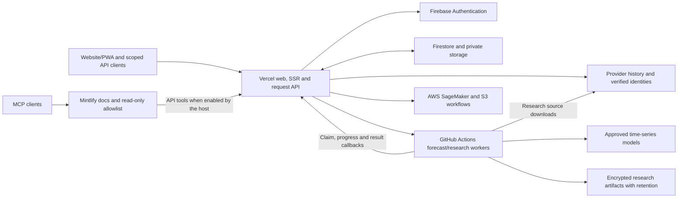
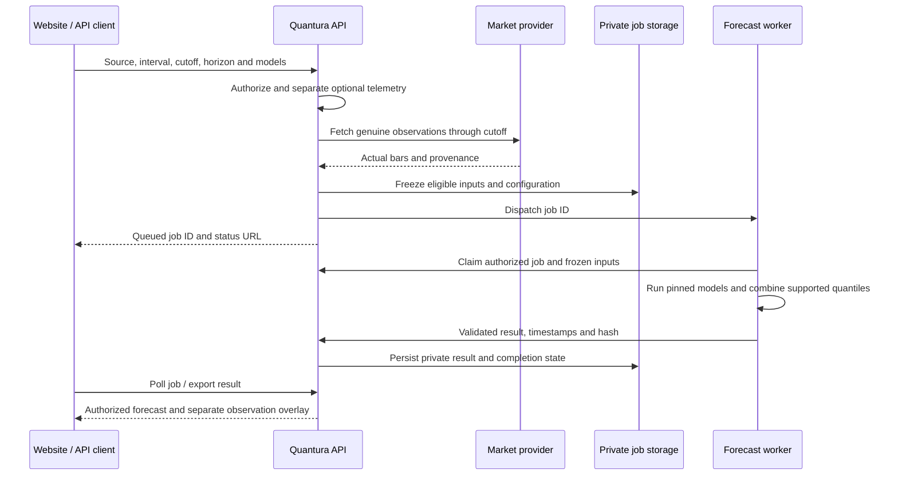

# Quantura

**Market data, probabilistic forecasts and reproducible strategy research.**

Quantura connects stocks, FX, metals, indices, perpetual contracts and prediction markets in one research workspace. Search an instrument, inspect genuine observations, forecast a range of outcomes, and retain the evidence behind a decision.

[Website](https://quantura.studio) · [API docs](https://quantura.mintlify.app) · [Wiki](https://github.com/tamzid2001/stockssagemakerdata/wiki) · [Releases](https://github.com/tamzid2001/stockssagemakerdata/releases)

## What's new in v2.1.0

- **Nine forecast intervals:** 1, 5, 15 and 30 minutes; 1 and 4 hours; daily, weekly and monthly. Weekly/monthly observations use real calendar boundaries, with matching website, API, worker and download support.
- **Latest and historical forecasts:** fix optional telemetry blocking request validation; support deep 120/180-day cutoffs and retained stock-price overlays when genuine provider history exists.
- **More data sources:** Dukascopy's full published instrument catalog, bid/ask downloads and efficient native candle archives; verified stock-provider fallback and rate-limit handling.
- **Today's games in Screener:** Kalshi/Polymarket US provider and outcome controls, actual market links, historical overlays and saved forecast navigation. Pregame runs use four or five available real models and six quantiles.
- **Reproducible backtesting:** SPY and mega-cap studies, separate long/short FTMO-style ladders, costs/open-liability reporting and causal triggered reforecasts.
- **A clearer product:** refreshed homepage and blog imagery, product-tour video, PWA presentation, mobile navigation and Support conversation history.

See the [release notes](docs/releases/v2.1.0.md) for the complete release scope and limitations.

## Research workflow

| Step | Where | What it provides |
| --- | --- | --- |
| Find an instrument | [Search](https://quantura.studio/forecasting#market-search-title) | Provider identity, exact ticker or market outcome, verified links |
| Inspect observations | [Download](https://quantura.studio/historical-data) | Genuine history, timestamps, quote sides, provenance and CSV exports |
| Compare opportunities | [Screener](https://quantura.studio/screener) | Stocks, perpetuals and today's available game forecasts; price-versus-quantile filters |
| Produce a distribution | [Forecast](https://quantura.studio/forecasting) | Model selection, quantiles, input cutoff, horizon, historical overlays and exports |
| Retain and investigate | Profile / My requests | Private saved forecasts, workspace data, reproducible configuration and API access |
| Evaluate a rule | API and repository research workers | Explicit fills, costs, equity paths, drawdown and open positions |

Forecasting is available through a secure guest session under fair-use limits. Signed-in users can retain private requests in their account; scopes, workspace membership and plan permissions are checked by the backend.

### Intervals and model support

| UI interval | Canonical frequency | Boundary |
| --- | --- | --- |
| 1 / 5 / 15 / 30 minutes | `1min` / `5min` / `15min` / `30min` | UTC interval grid |
| 1 / 4 hours | `1h` / `4h` | UTC interval grid |
| Daily | `1D` | Completed provider day; NYSE sessions for daily US-stock horizons |
| Weekly | `1W-MON` | Monday 00:00 UTC; stocks group exchange session dates |
| Monthly | `1MS` | First-of-month 00:00 UTC; real calendar month |

Market aliases include `5m`, `15m`, `30m`, `4h`, `1w` and `1Month`. A forecast length counts bars. Missing observations are not fabricated, and unfinished intervals are excluded from aggregated forecasts. Custom CSV frequency offsets remain supported.

The ensemble registry includes Prophet, Toto, IBM Granite, Chronos and TimesFM. Availability depends on genuine context length, requested quantiles, checkpoint access and licensing. Unsupported tails do not receive invented model values. Inspect `GET /api/v1/forecast/models` for current capabilities and frequencies.

[Historical cutoffs](docs/historical-forecasts.mdx) · [Interval guide](docs/forecast-frequencies.mdx) · [Forecast API](docs/ensemble-api.mdx) · [Model methodology](docs/ensemble-forecasting.md)

### Data sources

| Source | Supported research surface | Important distinction |
| --- | --- | --- |
| Alpaca / Yahoo Finance | Stocks, ETFs and supported market history | Effective provider, adjustment and exchange timezone are retained; provider history limits apply |
| Dukascopy | Full published catalog: FX, metals, indices and other provider CFDs | Bid/ask quotes and instrument-specific scales; equity CFDs are not exchange shares |
| Kalshi / Polymarket US | Exact binary outcomes and game forecasts | Outcome IDs, quote targets and verified game starts; probability units |
| Kalshi perpetuals | Perpetual contract discovery and history | Prices normalized to underlying exposure; separate from binary markets |
| Workspace / CSV | User-supplied time series | Validated timestamps, numeric target and explicit frequency |

The checked-in Dukascopy snapshot contains 1,504 instruments; the service refreshes the provider catalog and identifies stale snapshots. Candle archives avoid the multi-year hourly tick-download loop. Available history, request bounds, rate limits and redistribution rights still depend on the provider.

## API and MCP

- [Developer overview](https://quantura.studio/developers/api)
- [Live OpenAPI](https://quantura.studio/api/openapi.json)
- [Authentication](docs/authentication.mdx) and [workspace permissions](docs/workspace-collaboration.mdx)
- [Build a quantile strategy](docs/algorithmic-strategy.mdx)
- [MCP setup and allowlist](docs/mcp.mdx)

```bash
curl -H "Authorization: Bearer $QUANTURA_API_KEY" \
  https://quantura.studio/api/v1/forecast/models
```

Create an asynchronous forecast with `POST /api/v1/ensemble-forecasts`, an authorized session/key and an `Idempotency-Key`; poll its status before using its output. Strategy/backtest creation uses the HTTP API. The MCP allowlist exposes read-only discovery and capabilities when the documentation host supports API tools; check the client's actual tool list.

## Strategy research

The public `POST /api/v1/backtests` builder implements bounded, long-only, one-position quantile rules with next-observed-open fills. It does **not** implement the averaged long/short basket study's broker lots, swaps or basket-average targets.

Dedicated repository workers cover those studies:

- [SPY daily and intraday research](docs/spy-hourly-research.md): forecast extremes, adverse-only averaging, exits and median-direction comparisons.
- [Mega-cap year study](.github/workflows/megacap-p01-year.yml): one six-hour forecast and a shared replay methodology across stocks.
- [FTMO-style yearly matrix](docs/ftmo-dukas-hourly-study.md): ten assets, separate P01 long / P99 short ladders, bid/ask costs, commissions, swaps and carried liabilities.
- [Triggered reforecast workflow](.github/workflows/ftmo-trigger-reforecast.yml): eight FX/index assets, real minute triggers, completed-hour context and a remaining-session forecast.

A high closed-basket win rate can coexist with losing positions left open. Reports must include floating P&L, ladder size, duration, costs and drawdown. Optimization on the development period is not evidence of future returns or a prop-firm challenge pass. Kalshi coin workflows are **paper only**; see the [paper-only operating policy](docs/kalshi-coin-paper-only.md).

## Architecture and repository map

The public site, SSR and request APIs run on Vercel. Firebase provides identity and persistence; GitHub Actions runs forecast/research jobs. AWS supports the retained SageMaker workflows. A limited set of Google event jobs remains alongside the Vercel runtime.


```mermaid
flowchart LR
    Clients[Website/PWA and scoped API clients] --> API[Vercel web, SSR and request API]
    API --> Identity[Firebase Authentication]
    API <--> State[Firestore and private storage]
    API --> Data[Provider history and verified identities]
    API --> Workers[GitHub Actions forecast/research workers]
    Workers --> Models[Approved time-series models]
    Workers -->|Claim, progress and result callbacks| API
    Workers -->|Research source downloads| Data
    Workers --> Artifacts[Encrypted research artifacts with retention]
    API --> Legacy[AWS SageMaker and S3 workflows]
    MCP[MCP clients] --> Docs[Mintlify docs and read-only allowlist]
    Docs -->|API tools when enabled by the host| API
```

### Forecast request lifecycle


```mermaid
sequenceDiagram
    participant Client as Website / API client
    participant API as Quantura API
    participant Data as Market provider
    participant Store as Private job storage
    participant Worker as Forecast worker
    Client->>API: Source, interval, cutoff, horizon and models
    API->>API: Authorize and separate optional telemetry
    API->>Data: Fetch genuine observations through cutoff
    Data-->>API: Actual bars and provenance
    API->>Store: Freeze eligible inputs and configuration
    API->>Worker: Dispatch job ID
    API-->>Client: Queued job ID and status URL
    Worker->>API: Claim authorized job and frozen inputs
    Worker->>Worker: Run pinned models and combine supported quantiles
    Worker->>API: Validated result, timestamps and hash
    API->>Store: Persist private result and completion state
    Client->>API: Poll job / export result
    API-->>Client: Authorized forecast and separate observation overlay
```

Historical requests follow this same lifecycle. A 120/180-day cutoff selects earlier data before the N-bar limit; inference and publication still occur now. Optional consented telemetry stays outside the model configuration and forecast cache identity.


| Path | Purpose |
| --- | --- |
| `quantura_site/pages/` | Editable source HTML |
| `quantura_site/functions_ssr/templates/` | Generated SSR templates; sync from pages |
| `quantura_site/public/` | Browser code, styles, images, video and PWA assets |
| `quantura_site/functions_explore/src/` | TypeScript API, OpenAPI, provider adapters and permissions |
| `ensemble_forecasting/` | Model adapters, calendars, worker protocol and replay engine |
| `market_research/` / `forecast_intelligence/` | Study orchestration, audit, artifacts and research reports |
| `.github/workflows/` | CI, forecast execution, screeners and research matrices |
| `docs/` / `docs/wiki/` | API guides, methodology and tracked wiki source |
| `deploy.sh` | Production deployment from a committed source snapshot |

## Local setup and checks

Use **Node.js 24** and **Python 3.12**. The locked real-model environment is in `requirements-ensemble-forecast.lock`; routine engine checks can use mock models without loading checkpoints.

```bash
git clone https://github.com/tamzid2001/stockssagemakerdata.git
cd stockssagemakerdata
npm ci --prefix quantura_site
npm ci --prefix quantura_site/functions_explore

# Browser/UI checks and backend tests
npm run lint --prefix quantura_site
npm run test:ui --prefix quantura_site
npm test --prefix quantura_site/functions_explore

# Build assets and synchronize source pages into SSR templates
npm run build --prefix quantura_site
node quantura_site/functions_ssr/scripts/sync-templates.js

# Lightweight ensemble tests
python3.12 -m venv .venv
.venv/bin/python -m pip install numpy pandas pandas-market-calendars httpx pytest pyyaml==6.0.3
.venv/bin/python -m pytest -q ensemble_forecasting/tests
```

See [CONTRIBUTING.md](CONTRIBUTING.md) for the wider application test suite and [the release checklist](docs/release-checklist.md) for deployment gates. Provider-backed jobs require operator-provisioned credentials; local mock tests do not.

## Deployment and operations

Use `./deploy.sh` after committing and validating changes. The default Vercel workflow deploys API, compatibility API, newsletter, SSR and website projects in that order from `git archive HEAD`. Uncommitted changes are not deployed. `DEPLOY_DRY_RUN=true ./deploy.sh` prints the plan without publishing.

The stock screener checks hourly for the latest unpublished completed NYSE session. Exchange dates and frozen close cutoffs survive delayed Actions runs and UTC midnight. Validated JSON/CSV assets publish before the completion marker; failed scans stay eligible for retry.

Publication reads the checked-in model registry directly and is checked with Python site packages disabled, so aggregation does not require the inference worker's pandas/Pydantic stack. On October 3, the recovered October 2 scan published 3,568 valid five-model forecasts out of 3,607 stocks (98.92% coverage), with 39 explicitly unavailable histories/predictions.

Vercel function projects skip Git builds when their runtime inputs have not changed, including sitemap-only commits. Missing Git comparison metadata and explicit CLI deployments always build. Test files and caches are excluded from runtime bundles. Retention is set to one day for failed/canceled builds, seven days for previews, and fourteen days for production; active aliases and platform rollback protections still apply. Functions Storage is accrued GB-month usage, so deletions reduce future storage rather than resetting the month's usage.

Public-page OpenAI Ads and AWS Marketplace/Zift measurement follows the optional analytics choice and Global Privacy Control. Confirmed contact leads use matching browser/server event IDs. Pinterest domain verification is in the public HTML; credentials remain server-only. See [measurement and integrations](docs/partner-measurement.md).

Keep secrets in encrypted runtime/CI stores. Do not commit `.env` files, credentials, model tokens or raw private research artifacts. Read [secret handling](docs/secrets.md), [repository-size maintenance](docs/repository-size-maintenance.md) and [SECURITY.md](SECURITY.md).

[Wiki: architecture and operations](https://github.com/tamzid2001/stockssagemakerdata/wiki/Architecture-and-Operations) · [Troubleshooting](TROUBLESHOOTING.md)

## Contributing and license

[Contribution guide](CONTRIBUTING.md) · [Code of conduct](CODE_OF_CONDUCT.md) · [Security policy](SECURITY.md) · [License](LICENSE)

Provider data and model checkpoints can have separate licensing and redistribution conditions. Quantura forecasts and backtests are research tools, not guaranteed outcomes or financial advice.
