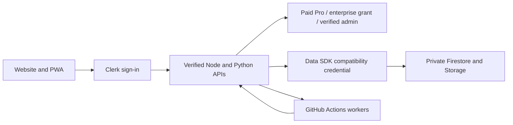

# Architecture and operations

## Runtime

Vercel serves the public website, SSR and request APIs. Clerk provides web authentication and account/organization components. Firestore and Storage retain private data through a verified compatibility bridge. Node and retained Python APIs verify Clerk sessions and preserve migrated user IDs. GitHub Actions performs forecast and research work; AWS supports retained SageMaker workflows. Limited Google event jobs remain.

| Directory | Responsibility |
| --- | --- |
| `quantura_site/pages/` | Editable HTML |
| `quantura_site/functions_ssr/` | SSR runtime and generated templates |
| `quantura_site/public/` | Browser scripts, styles, video and PWA assets |
| `quantura_site/functions_explore/src/` | API, permissions, OpenAPI and data adapters |
| `ensemble_forecasting/` | Calendars, model adapters, worker protocol and replay |
| `market_research/` | Study orchestration, source audits and artifacts |
| `.github/workflows/` | CI, scheduled screeners, inference and research matrices |
| `docs/` / `docs/wiki/` | API/methodology guides and wiki mirrors |

The forecast-capability endpoint and OpenAPI share the supported intervals. MCP adds read-only discovery/capabilities only where Mintlify API tools are available; costly job mutations remain authenticated HTTP operations.

## Authentication and data

Verified paid Clerk/Stripe subscriptions, Clerk private enterprise metadata, backend-only enterprise account records, or the verified administrator identity control API access. Trial-only subscriptions and user-editable metadata cannot grant API access. Public data caches use bounded memory; API-key activity writes are throttled and browser refreshes pause while hidden. Measure actual production usage before reporting savings.

## Deployment

Validate source, sync templates and commit before running `./deploy.sh`. Its default Vercel path uses `git archive HEAD`, deploying the API, compatibility API, newsletter, SSR and website in order. Local uncommitted files are excluded. `DEPLOY_DRY_RUN=true ./deploy.sh` prints the plan. The Google legacy option is not the primary public runtime.

Check the live website, authenticated paid/admin OpenAPI access, provider capabilities, affected history exports and Clerk/profile/forecast navigation after deployment. Verify the TikTok root file and Pinterest HTML meta tag; these are domain-ownership assets, not approval of TikTok OAuth or posting capabilities. Use the [release checklist](https://github.com/tamzid2001/stockssagemakerdata/blob/main/docs/release-checklist.md).

Function projects skip Git builds when their runtime inputs are unchanged. Explicit CLI/env-only deployments and missing comparison metadata always build. Test files and caches are excluded from function bundles. Current Vercel retention is 1 day for failed/canceled builds, 7 days for previews and 14 days for production, with active aliases protected. Storage cleanup reduces future GB-month usage rather than resetting accrued usage.

Public-page OpenAI Ads and AWS Marketplace/Zift measurement follows the optional analytics choice and Global Privacy Control. Confirmed contact leads share a browser/server event ID; credentials remain sensitive runtime variables. Pinterest verification is in public HTML. [Measurement coverage](https://github.com/tamzid2001/stockssagemakerdata/blob/main/docs/partner-measurement.md).

## Jobs and private data

- Ensemble jobs are authorized, claimed, executed and reported through the worker protocol with reproducible configuration/result identity.
- Model licensing/access gates remain enforced; private checkpoints are not published into public Actions caches.
- Game updates run hourly while pregame, stopping at the game's start hour.
- Research reports retain source hashes, failed/missing observations, costs, inference timing and carried liabilities.
- Artifacts use bounded retention. Summary packaging must succeed for empty/partial discovery.
- Kalshi coin live execution is disabled under the current paper-only policy.

Secrets belong in encrypted runtime/CI stores, never browser assets, git, logs or wiki pages. Device-scoped Support history retains up to 20 conversations for 30 days and is not cross-device account storage. GA4 server measurement is consented and keeps credentials private.

[Secrets](https://github.com/tamzid2001/stockssagemakerdata/blob/main/docs/secrets.md) · [Repository maintenance](https://github.com/tamzid2001/stockssagemakerdata/blob/main/docs/repository-size-maintenance.md) · [Security policy](https://github.com/tamzid2001/stockssagemakerdata/blob/main/SECURITY.md)

## BigQuery and write reductions

BigQuery public tables are searchable in Jev/Search and Research. The authenticated history service validates schema columns and exact parameterized filters, dry-runs scans, enforces a 100 MiB query cap and daily budgets, and provides normalized snapshots for preview/download/forecasts. Metadata and repeated queries use bounded caches without Firestore writes. Current revised histories are not publication-time vintages.

Successful API polling reads now use structured platform logs; mutations and failures retain durable audit documents. Key last-used updates coalesce across concurrent requests and persist at five-minute intervals. Identical Stripe subscription events avoid unchanged ledger/profile writes. Billing savings have not yet been measured on an invoice.

Clerk personal API keys are available to paid Pro and enterprise accounts and the verified Quantura administrator. Trials/free accounts do not have programmatic credentials. Native Clerk keys resolve migrated IDs and preserve resource ownership checks.
